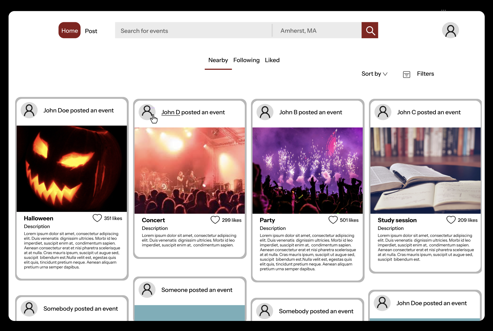
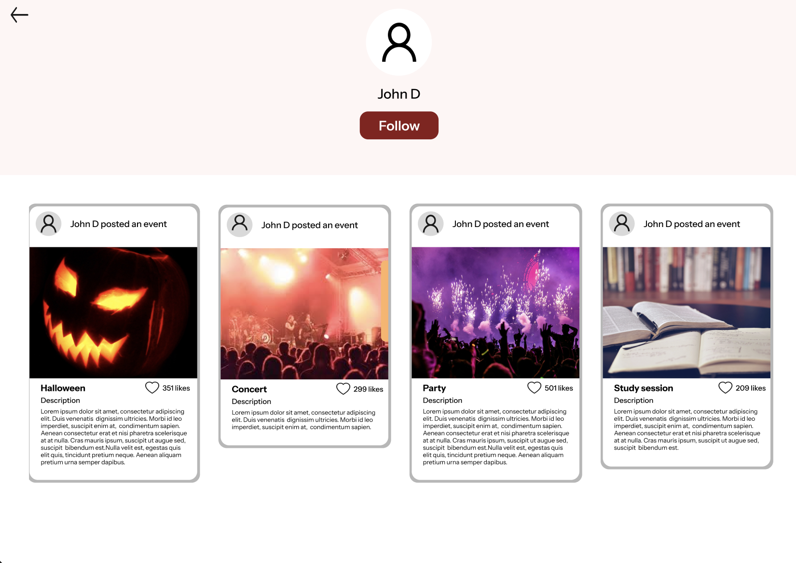
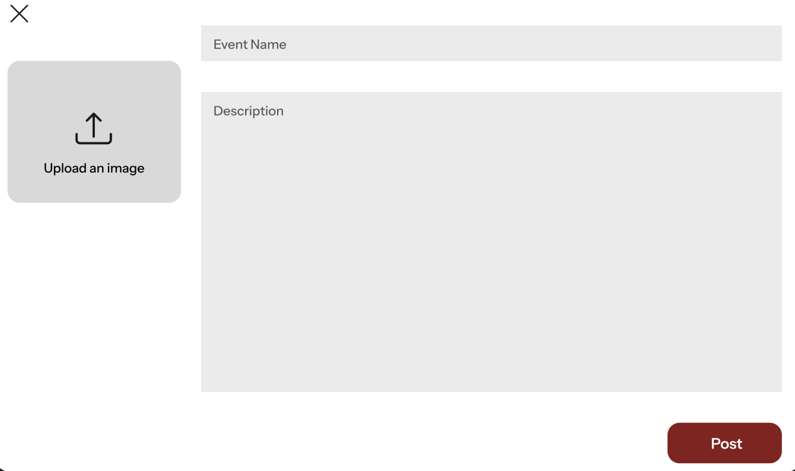

# # UI Diagrams

## Main Screen

The **Main Screen** serves as the user's entry point after logging into the app, offering a curated feed of events happening in their area. The design is clean and visually engaging, showcasing event posts that include images, descriptions, the event host's name, and the number of likes. Users can explore a variety of events, from concerts and parties to study sessions.

The screen provides a variety of interactive elements:

1. **Posts**: Each post features an event image, title, a short description, and the number of likes. The name of the event host appears at the top, helping users identify who shared the event.
2. **Filters and Sorting**: Located at the top right of the feed, the filter and sort options allow users to tailor their feed. Events can be filtered by interests, while sorting can be adjusted to show the nearest upcoming events or the most recent posts.
3. **Search Bar**: Positioned at the top of the screen, the search bar allows users to find specific events using keywords or locations, making it easier to search based on their preferences.
4. **Feed Buttons**: In the center of the screen, users can choose between “Nearby,” “Following,” or “Liked” feeds, offering the ability to view local events, events posted by people they follow, or their liked events.
5. **Home and Post Buttons**: On the top left of the screen, the "Home" button indicates that the user is on the main screen, while the "Post" button allows hosts to easily create and share new events.
6. **Profile Icon**: Located in the top right of the screen, the profile icon gives users quick access to their own profile to manage their account or view their posted events.
6. **Username**: Users can interact with others by hovering over a username (Here John D) in a post. This feature allows users to visit a poster’s profile by clicking on their name.

**Use Case**: 

A user searching for nearby events can enter their location or keywords in the search bar, then browse through the feed. They might spot an event that catches their eye based on the image, description and title. If they like the event, they can save it by liking the post, or explore similar events by following the user who shared it.

## User Profile Screen

The **User Profile Screen** offers an overview of a specific user's event activity, making it easy for others to follow their posts and explore all the events they've shared. The layout offers a convenient way to keep track of events posted by favorite organizers or friends.

Features include:
1. **Follow Button**: Located beneath the profile picture, this button allows users to follow or unfollow others. Once followed, future events from that user will automatically appear in the user's main feed.
2. **Posts**: All events posted by the user are displayed with event titles, descriptions, and number of likes.
3. **Back Button**: Located at the top-left of the screen, this button provides a quick way to return to the main screen once the user has finished viewing a profile.

**Use Case**: 

A user interested in a specific organizer's events can visit their profile, follow them for updates, and easily browse through their upcoming or past events. After following the profile, the user can click on the back button to return to the main screen where the "Following" feed will now include new events from this organizer.

## Event Creation Screen

The **Event Creation Screen** allows users to create new events. The screen has been designed for simplicity, and ease of use.

The key features include:
1. **Upload Button**: Users can upload an image to represent their event by clicking the "Upload an image" button. This image will be featured on the post.
2. **Event Details Form**: This form allows posters to input essential details, including the event's name and a description, providing all the necessary information for potential attendees. 
3. **Post Button**: Positioned at the bottom-right corner, the "Post" button allows users to publish their event once all the details are filled out.

**Use Case**: 

After planning an event, a user can upload a relevant image, fill in the event name and description, and click on "Post" to share the event with others. 