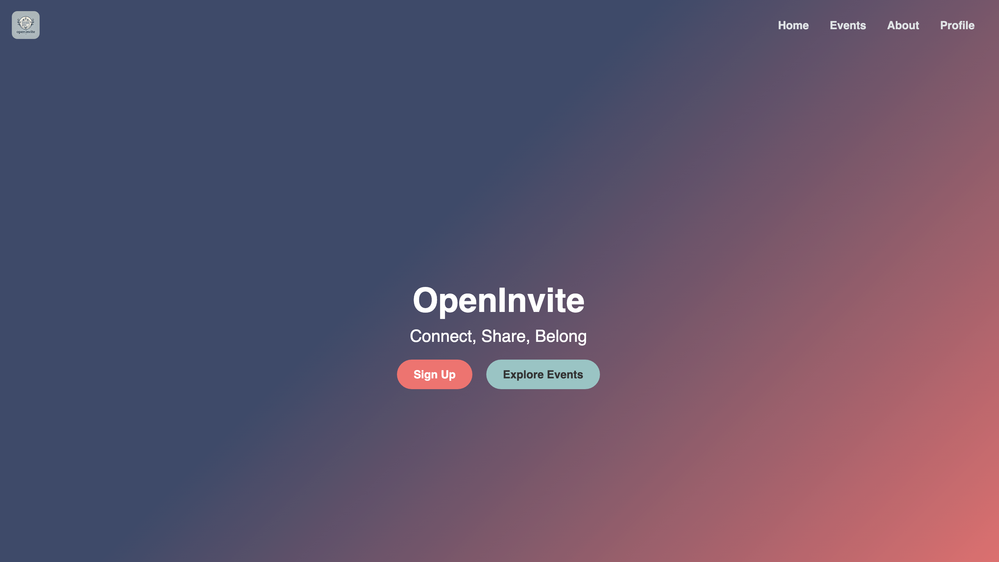
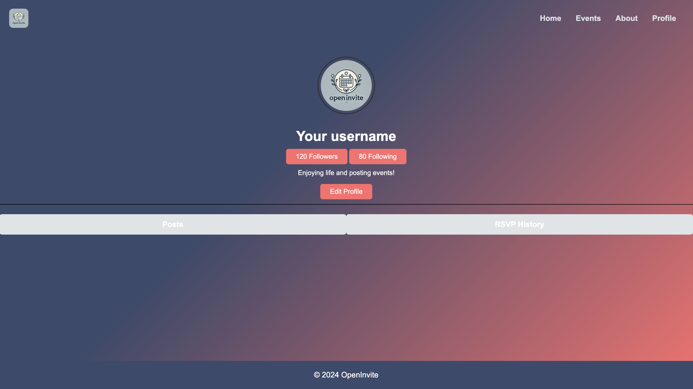

# # UI Diagrams

## Landing/Home Screen

The **Landing Screen** is the entry point of the OpenInvite platform, designed to welcome users and provide clear navigation options.

The screen provides a variety of interactive elements:

1. **Sign Up Button**: Allows new users to create an account.
2. **Explore Events Button**: Redirects users to browse events.
3. **Navigation Bar**: Includes links to "Home," "Events," "About," and "Profile," pages.

**Use Case**: 

A first-time visitor can sign up for an account using the "Sign Up" button or explore available events. Returning users can explore events and use the navigation bar to access other features.

## Login/Sign-Up Screen

The **Login/Sign-Up Screen** allows users to log in to their existing accounts or create a new account.

Features include:
1. **Login Form**: Includes fields for "Username" and "Password," along with a "Sign In" button.
2. **Posts**: Provides a link for new users to create an account with the "Create Account" button.

**Use Case**: 

A user can enter their credentials and sign in to access their account. If they don’t have an account, they can click "Create Account" to register.

## Search Screen

The **Search Screen** allows users to browse and search for events based on their interests or location.

The key features include:
1. **Search Bar**: Positioned at the top for users to search for events by keywords or location.
2. **Filter Categories**: Includes options to refine event browsing.

**Use Case**: 

A user looking for a specific event can select the desired filter or type specific keywords into the search bar to find relevant events.

## Event Screen

The **Event Screen** provides a scrollable feed of events, allowing users to explore and RSVP to events.

The screen provides a variety of interactive elements:

1. **Post**: Each post provides a scrollable feed of events, allowing users to explore and RSVP to events.
2. **Sorting Options**: Users can sort events by date or category using the buttons at the top.
3. **Create Event Button**: Allows users to create and share their own events.

**Use Case**: 

A user can scroll through the feed, find an event they’re interested in, and RSVP directly by clicking one of the options.

## Event Creation Screen

The **Event Creation Screen**  allows users to create and publish new events.

Features include:
1. **Form Fields**: input fields for event title, description, date, and location.
2. **Submit Button**: A "Create Event" button at the bottom enables users to post their event.
3. **Back Button**:  A "Back to Browse Events" button lets users return to the event feed.

**Use Case**: 

A user planning an event can fill in the details and click "Create Event" to share it with others.

## Profile Page

The **Profile Page** displays a user’s activity and allows them to manage their account.

The key features include:
1. **Profile Overview**: Displays the user’s username, profile picture, follower count, and bio.
2. **Tabs**: Provides "Posts" and "RSVP History" sections for users to view their shared events or RSVP history.
3. **Edit Profile**: An "Edit Profile" button allows users to update their bio, username or profile picture.

**Use Case**: 

A user can review their activity, update their profile details, and view their event posts or RSVP history.

## Followers and Following Screens

The **Followers and Following Screens** show the lists of users the profile owner follows or is followed by.

Features include:
1. **List**: Displays the usernames and profile pictures of followers or following accounts.
3. **Back Button**:  A "Back" button lets users return to the event feed.

**Use Case**: 

A user can browse their followers or the people they follow and click on profiles to explore their content.

## Edit Profile Modal

The **Edit Profile Modal** allows users to update their account details.

The key features include:
1. **Profile Picture Update**: Users can upload a new profile picture.
2. **Input Fields**:  Includes fields for updating the username and bio.
3. **Save Changes**:   A "Done" button saves the updates and closes the modal.

**Use Case**: 

A user wanting to change their bio or profile picture can access this modal, make changes, and save them.