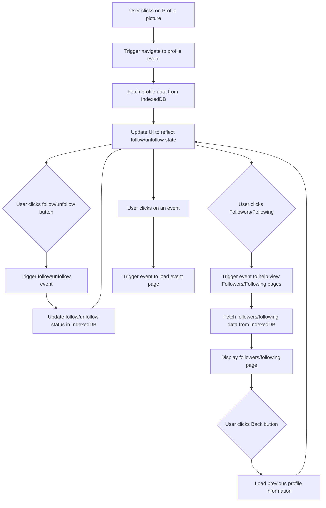

### User Profile Feature Sequence Diagram
This feature allows the user to edit their profile (e.g., name, bio, profile picture) and save updates dynamically. Changes are reflected in the UI immediately after being saved in the database. I worked on this with Erika Lam.

