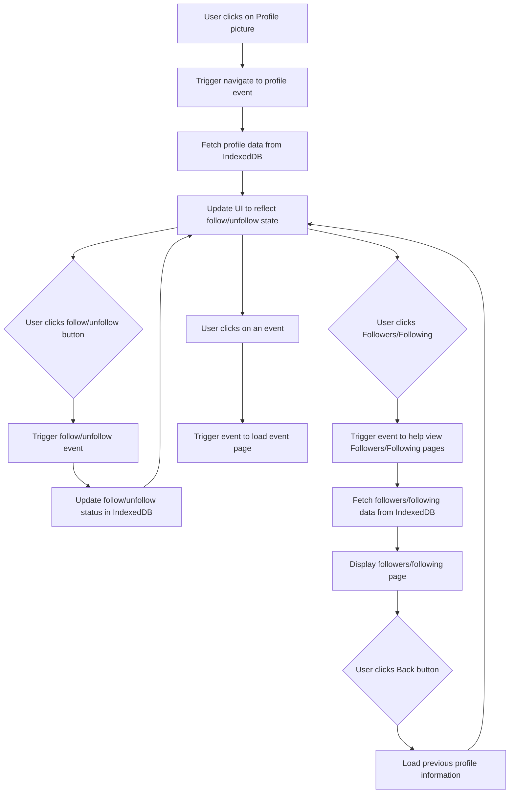

### User Profile Feature Sequence Diagram
The chosen feature is for accessing another user's profile. You should be able to interact with the User in multiple ways. When you click on their profile, whether in the following or in the followers, clicking the profile picture should guide you to the account. Then, the follow/unfollow button should update with their status. Then, when you click an event from a user, it should show all the event information. I worked on this with Anne-Colombe Sinkpon.

