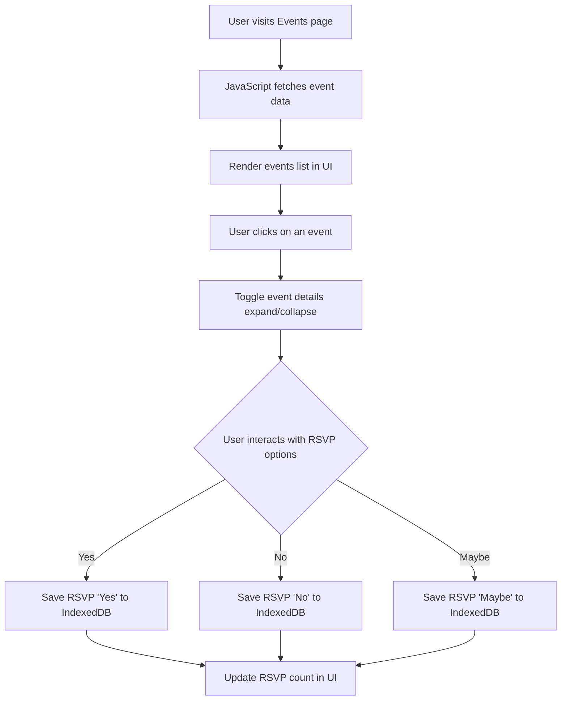

### Events Feature Sequence Diagram
The Events Feature allows users to view a list of events, click on an event to expand its details, and RSVP with responses ("Yes," "No," "Maybe"). The feature involves user interactions with the UI, JavaScript event listeners for dynamic updates, and data updates within IndexedDB.
