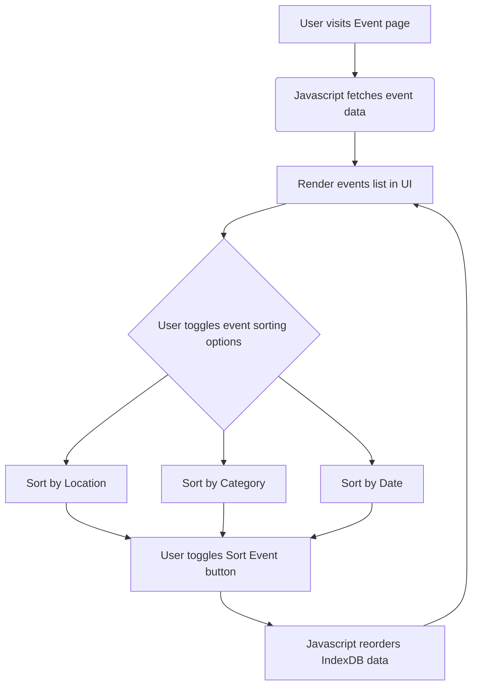

# Events Sort Feature Diagram

The events sorting feature allows a user to filter and reorder the display and list of events in the UI based on categorical, chronological, and geographical details. The user selects 1 of 3 options prompted in the UI and clicks sort, which triggers an event handler that re-orders the events based on the key selected and re-renders the UI to display events in order. 

